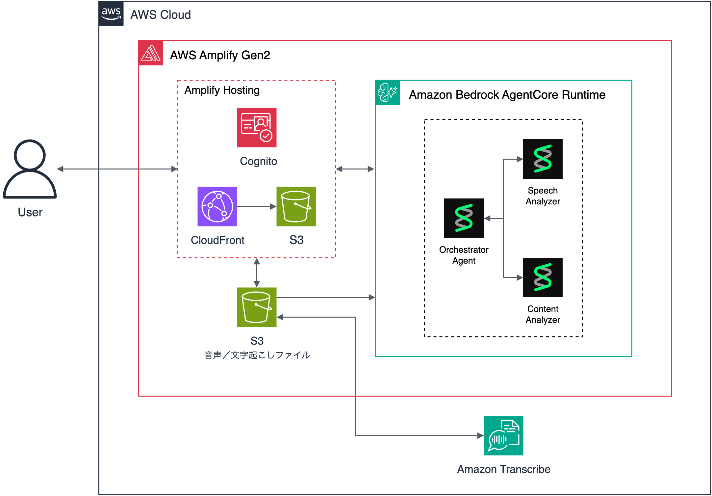

# Presentation Review Agent

プレゼンテーション音声をアップロードすると、AI が話し方・内容を多角的に分析してフィードバックを返すWebアプリケーションです。

音声 → 文字起こし（AWS Transcribe）→ AI 分析（Strands Agents on Bedrock）→ フィードバックレポート

## アーキテクチャ



1. ユーザーがブラウザから音声ファイルを S3 にアップロード
2. Cognito JWT 認証付きで AgentCore Runtime エンドポイントにリクエスト
3. AWS Transcribe で文字起こし → Orchestrator がサブエージェントで分析
4. 進捗と結果を SSE でリアルタイムにブラウザへストリーミング返却

> 図の編集: [doc/architecture-20260404.drawio](doc/architecture-20260404.drawio) を draw.io で開いてください

## 技術スタック

| 項目 | 技術 |
|------|------|
| フロントエンド | React + Vite + TypeScript |
| 認証 | Amazon Cognito（Amplify Auth） |
| ストレージ | Amazon S3（Amplify Storage） |
| ホスティング | AWS Amplify Hosting（CloudFront） |
| バックエンド | Amazon Bedrock AgentCore Runtime |
| エージェント | Strands Agents（Agents-as-Tools パターン） |
| LLM | Claude Sonnet（Amazon Bedrock） |
| 音声書き起こし | Amazon Transcribe |
| IaC | AWS CDK（Amplify Gen2） |

## 前提条件

- Node.js 18+
- Python 3.12+
- [uv](https://docs.astral.sh/uv/)（Python パッケージマネージャ）
- AWS CLI v2（認証済み）
- Docker（AgentCore コンテナビルド時）

## セットアップ

### Dev Container（推奨）

VS Code で Dev Container を使うと、必要なツールがすべてセットアップ済みの環境で開発できます。

1. VS Code で本リポジトリを開く
2. コマンドパレット → `Dev Containers: Reopen in Container`
3. コンテナ起動後、Python・Node.js・Docker が利用可能

### 手動セットアップ

```bash
# Python 依存関係
uv sync

# フロントエンド依存関係
cd frontend
npm install
```

## 開発

Amplify Gen2 CDK により、認証（Cognito）・ストレージ（S3）・AgentCore Runtime を一括でデプロイします。

```bash
cd frontend

# Amplify sandbox を起動（Cognito + S3 + AgentCore Runtime がプロビジョニングされる）
npx ampx sandbox

# 別ターミナルで開発サーバーを起動
npm run dev
```

sandbox が起動すると `amplify_outputs.json` が生成され、フロントエンドが自動的に AgentCore Runtime のエンドポイントに接続します。

## デプロイ

Amplify Hosting を使用します。GitHub リポジトリを接続すると、フロントエンド・認証・ストレージ・AgentCore Runtime が自動デプロイされます。

詳細は [doc/deploy-guide.md](doc/deploy-guide.md) を参照してください。

## 使い方

1. ブラウザでアプリにアクセスし、Cognito でログイン
2. 音声ファイル（mp3, wav, m4a, ogg, webm）をアップロード
3. 「分析開始」ボタンをクリック
4. 進捗がリアルタイムで表示される（文字起こし → 話し方分析 → 内容分析）
5. 分析結果（サマリー・良い点・改善点・推定コスト）を確認
6. レポートを Markdown でダウンロード可能

## ディレクトリ構成

```
presentation-review-agent/
├── frontend/                   # React + Vite + Amplify Gen2
│   ├── amplify/                # Amplify バックエンドリソース定義 (CDK)
│   │   ├── auth/resource.ts    #   Cognito 認証
│   │   ├── storage/resource.ts #   S3 ストレージ
│   │   ├── agent/              #   AgentCore Runtime
│   │   │   ├── resource.ts     #     CDK リソース定義
│   │   │   └── runtime/        #     Python コード + Dockerfile
│   │   │       ├── Dockerfile
│   │   │       ├── main.py     #     AgentCore エントリーポイント
│   │   │       ├── agents/     #     Strands Agents
│   │   │       ├── tools/      #     Transcribe連携・コスト算出
│   │   │       └── events/     #     SSE イベント生成
│   │   └── backend.ts          #   統合定義
│   ├── src/
│   │   ├── components/
│   │   │   ├── layout/         #   Header
│   │   │   ├── upload/         #   AudioUploader（D&D対応）
│   │   │   ├── analysis/       #   AnalysisRunner（進捗・結果表示）
│   │   │   └── result/         #   SummaryCard, StrengthsList 等
│   │   ├── hooks/
│   │   │   ├── useAudioUpload.ts   # S3 アップロード
│   │   │   ├── useSSEChat.ts       # AgentCore SSE 通信
│   │   │   └── useFileDelete.ts    # S3 ファイル削除
│   │   └── types/              # SSE イベント型定義
│   └── package.json
├── doc/                        # ドキュメント
│   ├── architecture-20260404.drawio  # アーキテクチャ図 (draw.io)
│   ├── architecture-20260404.png     # アーキテクチャ図 (PNG)
│   ├── basic_design.md         #   設計書
│   ├── deploy-guide.md         #   デプロイガイド
│   ├── observability-setup.md  #   Observability 設定ガイド
│   ├── monitoring-guide.md     #   CloudWatch モニタリングガイド
│   ├── pricing-update-guide.md #   料金テーブル更新手順
│   ├── s3-lifecycle-guide.md   #   S3 ライフサイクル設定ガイド
│   └── progress.md             #   開発進捗
├── .devcontainer/              # Dev Container 設定
├── pyproject.toml
└── README.md
```