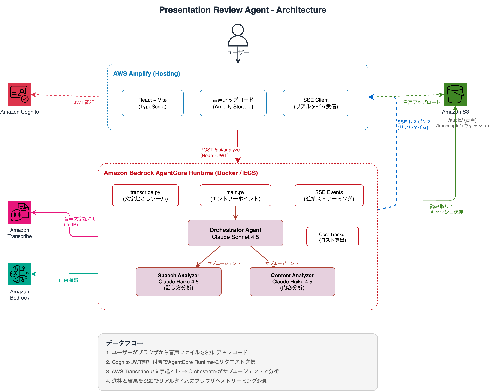

# Presentation Review Agent

プレゼンテーション音声をアップロードすると、AI がフィードバックを返すWebアプリケーションです。

音声 → 文字起こし（AWS Transcribe）→ AI 分析（Strands Agents on Bedrock）→ フィードバックレポート

## アーキテクチャ



1. ユーザーがブラウザから音声ファイルを S3 にアップロード
2. Cognito JWT 認証付きで AgentCore Runtime にリクエスト送信
3. AWS Transcribe で文字起こし → Orchestrator がサブエージェントで分析
4. 進捗と結果を SSE でリアルタイムにブラウザへストリーミング返却

> 図の編集: [doc/architecture.drawio](doc/architecture.drawio) を draw.io で開いてください

## 前提条件

- Node.js 18+
- Python 3.12+
- [uv](https://docs.astral.sh/uv/) (Python パッケージマネージャ)
- AWS CLI v2（認証済み）
- Docker（バックエンドのデプロイ時）

## セットアップ

### フロントエンド

```bash
cd frontend
npm install

# Amplify sandbox を起動（Cognito + S3 がローカル環境にプロビジョニングされる）
npx ampx sandbox

# 別ターミナルで開発サーバーを起動
npm run dev
```

### バックエンド

```bash
# 依存関係のインストール
uv sync

# ローカル環境変数を設定（S3バケット名等）
cp backend/.env.example backend/.env
# backend/.env を編集

# ローカル起動
cd backend
agentcore dev
```

## デプロイ

### フロントエンド

Amplify Hosting を使用します。GitHub リポジトリを接続すると自動デプロイされます。

### バックエンド

AgentCore Starter Toolkit を使用します。

```bash
cd backend

# Docker イメージをビルド & ECR にプッシュ & AgentCore にデプロイ
agentcore launch
```

デプロイ後、AgentCore エンドポイントに Cognito JWT 認証を設定してください。

## 使い方

1. ブラウザでアプリにアクセスし、Cognito でログイン
2. 音声ファイル（mp3, wav, m4a, ogg, webm）をアップロード
3. 「分析開始」ボタンをクリック
4. 進捗がリアルタイムで表示される（文字起こし → 話し方分析 → 内容分析）
5. 分析結果（サマリー・良い点・改善点・推定コスト）を確認
6. レポートを Markdown でダウンロード可能

## ディレクトリ構成

```
presentation-review-agent/
├── frontend/                   # React + Vite + Amplify Gen2
│   ├── amplify/                # Amplify バックエンドリソース定義
│   │   ├── auth/resource.ts    #   Cognito 認証
│   │   ├── storage/resource.ts #   S3 ストレージ
│   │   └── backend.ts          #   統合定義
│   ├── src/
│   │   ├── components/
│   │   │   ├── layout/         #   Header
│   │   │   ├── upload/         #   AudioUploader（D&D対応）
│   │   │   ├── analysis/       #   AnalysisRunner（進捗・結果表示）
│   │   │   └── result/         #   SummaryCard, StrengthsList 等
│   │   ├── hooks/
│   │   │   ├── useAudioUpload.ts   # S3 アップロード
│   │   │   ├── useSSEChat.ts       # AgentCore SSE 通信
│   │   │   └── useFileDelete.ts    # S3 ファイル削除
│   │   └── types/              # SSE イベント型定義
│   └── package.json
├── backend/                    # Python (AgentCore)
│   ├── agents/
│   │   ├── orchestrator.py     #   統括エージェント (Sonnet 4.5)
│   │   ├── speech_analyzer.py  #   話し方分析 (Haiku 4.5)
│   │   └── content_analyzer.py #   内容分析 (Haiku 4.5)
│   ├── tools/
│   │   ├── transcribe.py       #   AWS Transcribe 連携
│   │   └── cost_tracker.py     #   エージェント実行コスト算出
│   ├── events/
│   │   └── sse.py              #   SSE イベント生成
│   ├── logging_config.py       #   構造化ログ設定
│   ├── main.py                 #   AgentCore エントリーポイント
│   └── Dockerfile
├── doc/                        # ドキュメント
│   ├── architecture.drawio     #   アーキテクチャ図 (draw.io)
│   ├── architecture.png        #   アーキテクチャ図 (PNG)
│   ├── basic_design.md         #   設計書
│   ├── progress.md             #   開発進捗
│   ├── pricing-update-guide.md #   料金テーブル更新手順
│   ├── monitoring-guide.md     #   CloudWatch モニタリングガイド
│   └── s3-lifecycle-guide.md   #   S3 ライフサイクル設定ガイド
├── pyproject.toml
└── README.md
```
